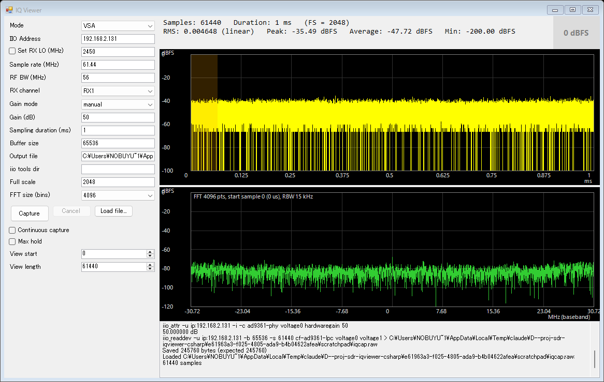
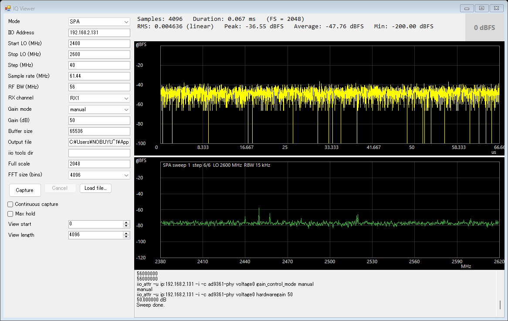

# IqViewer (C# WinForms)

LibreSDR / PlutoSDR 系 (AD9361) から IQ データを取得し、時間波形・スペクトルを表示する Windows GUI アプリです。
取得は libiio のコマンドラインツール (`iio_attr` / `iio_readdev`) を呼び出して行います。

- **VSA モード**: 固定 LO で取り込み、時間波形(dBFS)と Marker 位置からの FFT を表示
- **SPA モード**: LO を Start〜Stop まで Step で動かしながら、広帯域スペクトルを 1 枚にまとめて表示
- 連続キャプチャ、Max hold、0 dBFS 検出ランプ、RX1 / RX2 切り替え

## 動作環境

- Windows 10 / 11 (x64)
- .NET Framework 4.7.2
- Visual Studio 2019 (ビルド用)
- libiio 0.26 以降のコマンドラインツール (`iio_attr.exe`, `iio_readdev.exe`) が PATH にあること
  (PATH に無い場合は GUI の「iio tools dir」にフォルダを指定)
- アプリは **x64 固定** です。32bit プロセスでは `System32` のツールが見えなくなるためです。

## ビルド

Visual Studio 2019 で `IqViewer.sln` を開き、構成 `Debug|x64` または `Release|x64` をビルドします。
コマンドラインでは次のとおりです。

```
"C:\Program Files (x86)\Microsoft Visual Studio\2019\Community\MSBuild\Current\Bin\MSBuild.exe" IqViewer.sln -p:Configuration=Release -p:Platform=x64
```

出力は `bin\Release\IqViewer.exe` (Debug は `bin\Debug\`) です。外部ライブラリ・NuGet は使っていません。

## 使い方

1. 「IIO Address」に SDR の IP アドレスを入れる。
2. Mode (VSA / SPA) とパラメータを設定して **Capture** を押す。
3. 取得したデータは出力ファイルに保存され、そのまま表示される。**Cancel** で中断できる。
4. **Load file...** で既存の IQ ファイルを SDR なしで表示できる。

### 画面構成

| 領域 | 内容 |
|---|---|
| 左パネル | パラメータ入力、Capture / Cancel / Load file |
| 上段 | 時間波形 (dBFS)。ホイールでズーム、ドラッグでパン、クリックで Marker 設置 |
| 下段 | スペクトル (dBFS)。VSA はベースバンド、SPA は絶対周波数 |
| 統計表示 | RMS / Peak / Average / Min と、右端の 0 dBFS ランプ |
| 最下段 | 実行したコマンドとエラーのログ |

VSA モード (初期値のまま Capture):



SPA モード (LO 2400〜2600 MHz、Step 40 MHz のスイープ):



### パラメータ(初期値)

| 項目 | 初期値 | 説明 |
|---|---|---|
| Mode | VSA | VSA / SPA |
| IIO Address | 192.168.2.131 | `iio_*` の `-u ip:<address>` に渡す |
| Set RX LO (MHz) | OFF / 2450 | VSA のみ。チェック時に RX LO を設定 (50〜6000 MHz) |
| Start / Stop LO (MHz) | 2400 / 2600 | SPA のみ。LO の掃引範囲 |
| Step (MHz) | 40 | SPA のみ。LO の刻み |
| Sample rate (MHz) | 61.44 | 小数可 |
| RF BW (MHz) | 56 | 小数可 |
| RX channel | RX1 | RX1 / RX2 (下記「RX2」参照) |
| Gain mode | manual | manual / slow_attack / fast_attack / hybrid |
| Gain (dB) | 50 | manual のときのみ設定 |
| Sampling duration (ms) | 1 | VSA のみ。取り込み時間 (小数可)。サンプル数 = 時間 × サンプルレート |
| Buffer size | 65536 | `iio_readdev -b` |
| Output file | `iqcap.raw` (exe と同じフォルダ) | 取得データの保存先。毎回上書き |
| iio tools dir | (空) | 空なら PATH から探す |
| Full scale | 2048 | dBFS の基準 (AD9361 は 12bit)。16bit 全域なら 32768 |
| FFT size (bins) | 4096 | 32 / 64 / … / 4096 |

## モード

### VSA

1. `iio_attr` でサンプルレート、RF BW、ゲイン(と、チェック時は RX LO)を設定
2. `iio_readdev` で Sampling duration 分を取り込み、出力ファイルに保存
3. 時間波形と統計を表示。**Marker** (波形をクリック) の位置から FFT サイズ分を **1 回だけ FFT** (平均なし、Hann 窓) し、下段に表示。Marker から FFT 範囲を薄いオレンジで示す

### SPA

LO を `Start, Start+Step, …` (≤ Stop) と動かし、各 LO で次の処理を行います。

1. `iio_attr` で RX LO を設定し、`iio_readdev` で FFT size 個のサンプルを取り込む
2. 先頭から 1 回 FFT (平均なし、Hann 窓)
3. FFT の **中央 Step 幅だけ** を切り出して連結 (DC スパイクと帯域端のロールオフを避けるため)

- Start / Stop / Step は **LO 周波数** です。表示範囲は `Start − Step/2` 〜 `最終 LO + Step/2` です。
- 周波数分解能 (RBW) = サンプルレート ÷ FFT size です。上部の情報行に表示されます。
- 入力チェック: 50 ≤ Start ≤ Stop ≤ 6000 MHz、Step > 0、Step ≤ サンプルレート、ステップ数 ≤ 5000。
  Step は RF BW 以下にしてください (超えるとフィルタのロールオフ部分を使います)。
- 1 ステップごとにコマンドを 2 回起動するため、1 ステップあたり 0.3〜1 秒程度かかる見込みです。
- 時間波形パネルと統計は、直近のステップのものです。

## 連続キャプチャ

「Continuous capture」をチェックして Capture すると、Cancel を押すかエラーが出るまで繰り返します。

- VSA: 取り込み → 表示を繰り返す。ズーム・パン・Marker 位置は維持されます。
- SPA: スイープを繰り返す。前回のトレースは、各ステップが上書きするまで残ります。
- **実行中のパラメータ変更に対応**: 次の読み出し (SPA は次のスイープ) の前に入力欄を読み直し、
  SDR 設定に関わる項目 (サンプルレート、RF BW、LO、RX チャネル、ゲイン、アドレスなど) が変わったときだけ
  `iio_attr` で再設定します。入力途中などの不正な値は無視され、直前の有効な値で続行します。
- iio コマンド失敗時はエラーをログに出して停止します。

## Max hold

「Max hold」をチェックすると、連続キャプチャ中にスペクトルの各点の最大値を保持します (VSA / SPA 共通)。
次の場合は保持値をクリアします。

- チェックの切り替え、新しい Capture の開始
- VSA: Marker 位置、FFT size、サンプルレート、Full scale の変更
- SPA: 周波数レイアウト (Start / Stop / Step、サンプルレート、FFT size) の変更
- SDR 設定 (ゲインなど) の再設定

## 0 dBFS ランプ

統計表示の右端のランプは、表示したデータの Peak が **−0.1 dBFS 以上** になると赤く点滅し、最後の検出から 1.5 秒間続きます
(ADC の飽和したサンプル 2047/2048 は −0.004 dBFS 程度になるため、0 ちょうどではなく −0.1 を閾値にしています)。
VSA、SPA (各ステップ)、ファイル読み込みのどれでも判定します。
閾値は `MainForm.cs` の `ClipDbfs` で変更できます。

## 統計の定義

各サンプルの振幅 `m = √(I² + Q²) / FullScale` から計算します。

| 項目 | 定義 |
|---|---|
| RMS | `√(mean(m²))` (リニア値、dB 変換しない) |
| Peak | `20·log10(max m)` dBFS |
| Average | `20·log10(mean m)` dBFS |
| Min | `20·log10(min m)` dBFS (0 のときは −200 dBFS) |

## IQ ファイル形式

リトルエンディアン `int16` の `I, Q, I, Q, …` のインターリーブ (1 サンプル 4 バイト)。
`iio_readdev` の標準出力をそのまま保存しています。拡張子は任意です (Load file は `*.raw`, `*.bin`, `*.cs16` を既定で表示)。

## RX2

RX2 は SDR が **2R2T モード** のときだけ存在します。1R1T のままで RX2 を選ぶと、
設定を変更する前に `RX2 not found: the SDR is not in 2R2T mode` を出して中止します。

- RX1 は `cf-ad9361-lpc` の `voltage0/1`、RX2 は `voltage2/3`。ゲインは `ad9361-phy` の入力 `voltage0` / `voltage1`。
- `iio_readdev` には常にチャネルを明示して実行します (指定しないと 2R2T で 4ch 混在になるため)。
- サンプルレートと RF BW、LO は RX1/RX2 共通です。
- 2R2T への切り替えは SDR 側の設定です (tezuka ファームの `config.txt` の `mode = 2r2t`、または `fw_setenv mode 2r2t` など)。
  この手順は公開情報によるもので、手元の機器では未確認です。切り替え後は
  `iio_attr -u ip:<address> -c cf-ad9361-lpc voltage2 sampling_frequency` が成功することで確認できます。
- 2R2T ではサンプルレートの上限が下がることがあります。

## ソース構成

| ファイル | 役割 |
|---|---|
| `Program.cs` | エントリポイント |
| `MainForm.cs` | 画面、パラメータ読み取りと検証、VSA / SPA / 連続キャプチャの制御 |
| `SdrCapture.cs` | `iio_attr` / `iio_readdev` の実行 (設定、LO 設定、読み出し、キャンセル) |
| `IqData.cs` | IQ ファイルの読み込み、統計 |
| `Fft.cs` | FFT (サイズごとの回転係数・ビット反転・窓を事前計算) |
| `Sweep.cs` | SPA の周波数レイアウト、スペクトルの連結、Max hold |
| `WaveformControl.cs` | 時間波形の描画、ズーム / パン、Marker |
| `SpectrumControl.cs` | スペクトルの描画 (ベースバンド / 絶対周波数) |

## 既知の制限

- キャンセルは実行中の `iio_*` プロセスを終了させる形で行います。
- SPA は 1 ステップごとにプロセスを起動するため低速です (libiio を直接使えば高速化できます)。
- 自動テストはありません。確認は実機での手動確認です。
